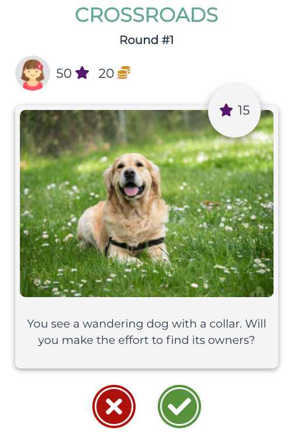
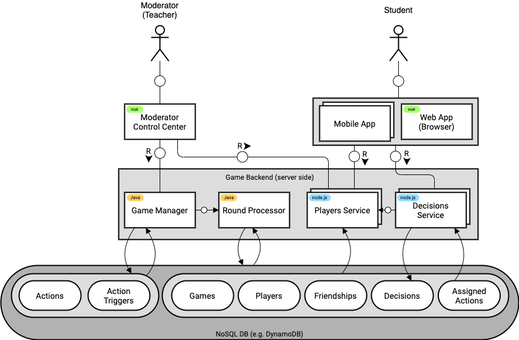

# CROSSROADS

# Overview

Crossroads is a decision-making simulation moderated turn-based game for 4th-8th grade students. The game utilizes a simple mechanism of swiping right or left for taking a suggested action or not. During the game, the student will have to take ~1000 different decisions, each one will affect the player’s progress and development just like real life decisions. There is no right or wrong path, but rather learning the decisions’ underlying tradeoffs.

https://crossroads-66894.web.app/

# High Level Architecture

